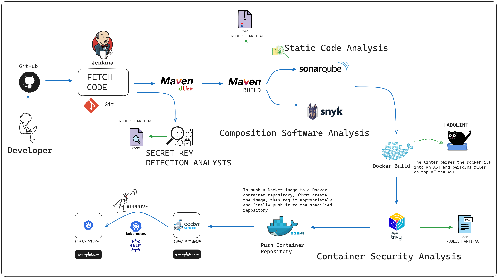
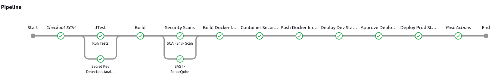

# Jenkins-SecOps



This project contains a Java Spring Boot and PostgreSQL application containerized with Docker running on Kubernetes. Additionally, a SecOps pipeline was established within the project using Jenkins.

## Used technologies

**Technology:** Java, Maven, Spring Boot, Postgresql, Docker, K8S, Jenkins, Snyk Scan, Trivy, Hadolint, SonarQube

**Os:** Ubuntu

## Demo



  
## Security

- Pre-commit Secret Detection
- JUNIT (Java Testing Framework)
- SAST (Static Application Security Testing)
- SCA (Software Composition Analysis)
- CSA (Container Security Assessment)
  
## Installation

Clone the project:

```bash
  git clone <project-url>
```

Navigate to the project directory:

```bash
  cd <project-directory>
```

Install the necessary dependencies:


```bash
  mvn package
```

## Step by Step Installation

- 1- We need to install Jenkins.


```
  cd setup/jenkins
  chmod +x install_jenkins.sh
  ./install_jenkins.sh
```

- 2- We need to install Trivy.


```
  cd setup/trivy
  chmod +x install_trivy.sh
  ./install_trivy.sh
```

- 3- We need to install Hadolint.


```
  cd setup/hadolint
  chmod +x install_hadolint.sh
  ./install_hadolint.sh
```

- 4- We need to install Docker and Docker Compose.

  [Docker Installation Guide](https://docs.docker.com/engine/install/ubuntu/)

  [Docker-Compose Installation Guide](https://docs.docker.com/compose/install/linux/)


- 5- We need to install Minikube - k8s.
  [Minikube Installation Guide](https://minikube.sigs.k8s.io/docs/)

- 6- We need to install SonarQube.

```
  cd setup/sonarqube
  docker-compose up -d
```

- 7- We need to install Snyk Scan. (Free-Cloud)

  [Snyk Scan](https://docs.snyk.io/scan-using-snyk)

## 🔗 Links

[](https://tr.linkedin.com/in/ramazanakkulak/)

## Lisans

[MIT](https://choosealicense.com/licenses/mit/)

  